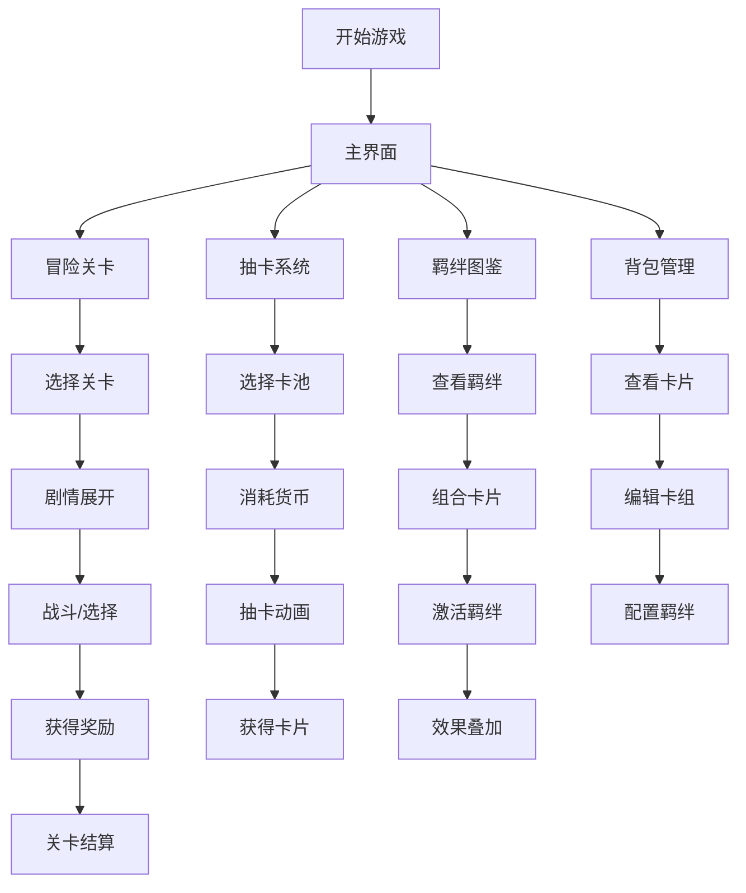

# 文字互动游戏 - 产品需求文档 (PRD)

## 1. 产品概述
一款融合闯关冒险与抽卡养成的文字互动游戏。玩家通过文字剧情探索关卡，收集并组合不同卡片，激活羁绊效果，利用卡片能力叠加策略战胜挑战。

- **目标用户**: 喜欢策略养成、文字冒险的玩家
- **核心价值**: 羁绊系统带来的深度策略组合，每次游戏都有不同体验

## 2. 核心功能

### 2.1 用户角色
| 角色 | 说明 |
|------|------|
| 玩家 | 单机游戏，无需注册，本地存档 |

### 2.2 功能模块
1. **主界面**: 游戏入口、玩家状态、卡组管理
2. **冒险关卡**: 文字剧情、选择分支、战斗系统
3. **抽卡系统**: 卡池抽取、卡片收集、稀有度系统
4. **羁绊系统**: 卡片组合、羁绊激活、效果叠加
5. **背包/卡组**: 卡片管理、装备配置

### 2.3 页面详情
| 页面名称 | 模块名称 | 功能描述 |
|----------|----------|----------|
| 主界面 | 玩家状态栏 | 显示等级、金币、钻石、体力 |
| 主界面 | 功能入口 | 冒险、抽卡、背包、羁绊图鉴 |
| 冒险关卡 | 地图选择 | 关卡列表、解锁状态、星级评价 |
| 冒险关卡 | 剧情面板 | 文字描述、选项按钮、NPC对话 |
| 冒险关卡 | 战斗面板 | 敌我状态、技能选择、卡片效果 |
| 抽卡系统 | 卡池选择 | 普通池、限定池、保底显示 |
| 抽卡系统 | 抽卡动画 | 卡牌翻转、稀有度特效、结果展示 |
| 羁绊系统 | 羁绊列表 | 已激活羁绊、未激活羁绊、效果预览 |
| 羁绊系统 | 卡片组合 | 拖拽组合、羁绊激活条件检测 |
| 背包/卡组 | 卡片列表 | 筛选、排序、详情查看 |
| 背包/卡组 | 卡组编辑 | 上阵卡片、羁绊预览、战力计算 |

## 3. 核心流程

### 3.1 游戏主流程
玩家进入游戏 → 查看当前状态 → 选择冒险关卡 → 阅读剧情 → 遭遇战斗 → 使用卡片技能 → 获胜获得奖励 → 抽卡获取新卡 → 组合羁绊 → 挑战更高难度

### 3.2 抽卡羁绊流程图


## 4. 用户界面设计

### 4.1 设计风格
- **主题色**: 深紫渐变 + 金色点缀（神秘魔幻风格）
- **按钮风格**: 圆角矩形、微光边框、悬浮阴影
- **字体**: 标题使用艺术字体，正文使用清晰易读字体
- **布局**: 卡片式布局，居中对称
- **动效**: 卡牌翻转、粒子特效、光晕动画

### 4.2 卡片设计
| 属性 | 描述 |
|------|------|
| 稀有度 | N(灰)、R(蓝)、SR(紫)、SSR(金) |
| 类型 | 攻击、防御、辅助、特殊 |
| 元素 | 火、水、风、土、光、暗 |
| 羁绊标签 | 用于触发羁绊的分类标签 |

### 4.3 羁绊系统设计
| 羁绊类型 | 激活条件 | 效果示例 |
|----------|----------|----------|
| 元素羁绊 | 同元素卡片3张 | 火焰羁绊：攻击+30% |
| 类型羁绊 | 同类型卡片2张 | 战士羁绊：生命+20% |
| 组合羁绊 | 特定卡片组合 | 剑与盾：防御时反弹伤害 |
| 稀有羁绊 | 全SSR卡片 | 传说之力：全属性+50% |
| 连锁羁绊 | 多羁绊同时激活 | 羁绊共鸣：效果翻倍 |

### 4.4 效果叠加规则
1. **同源叠加**: 相同来源的效果数值相加
2. **异源叠加**: 不同来源的效果取最高值
3. **乘法叠加**: 百分比效果在基础值上相乘
4. **特殊覆盖**: 某些独特效果会覆盖普通效果

### 4.5 页面设计概览
| 页面名称 | 模块名称 | UI元素 |
|----------|----------|--------|
| 主界面 | 顶部状态栏 | 半透明背景、图标+数值、渐变边框 |
| 主界面 | 功能入口 | 4个大按钮、悬浮动画、粒子背景 |
| 抽卡系统 | 抽卡区域 | 中央卡牌、光圈特效、十连按钮 |
| 羁绊系统 | 羁绊卡片 | 卡片槽位、连线动画、激活光效 |
| 战斗面板 | 战斗界面 | 敌我分列、技能按钮、状态条 |

### 4.6 响应式设计
- 桌面优先设计，适配移动端
- 触控优化，按钮足够大
- 卡片可拖拽操作

## 5. 游戏数值设计

### 5.1 卡片属性
```typescript
interface Card {
  id: string;
  name: string;
  rarity: 'N' | 'R' | 'SR' | 'SSR';
  type: 'attack' | 'defense' | 'support' | 'special';
  element: 'fire' | 'water' | 'wind' | 'earth' | 'light' | 'dark';
  baseStats: {
    attack: number;
    defense: number;
    hp: number;
    speed: number;
  };
  skill: {
    name: string;
    description: string;
    cooldown: number;
    effect: Effect;
  };
  bondTags: string[]; // 羁绊标签
}
```

### 5.2 羁绊效果
```typescript
interface Bond {
  id: string;
  name: string;
  requiredTags: { tag: string; count: number }[];
  effects: Effect[];
  description: string;
}

interface Effect {
  type: 'stat_boost' | 'skill_enhance' | 'special';
  target: 'self' | 'team' | 'enemy';
  value: number;
  isPercentage: boolean;
}
```

### 5.3 抽卡概率
| 稀有度 | 概率 | 保底机制 |
|--------|------|----------|
| N | 60% | - |
| R | 30% | - |
| SR | 8% | 10抽必出 |
| SSR | 2% | 50抽必出 |
