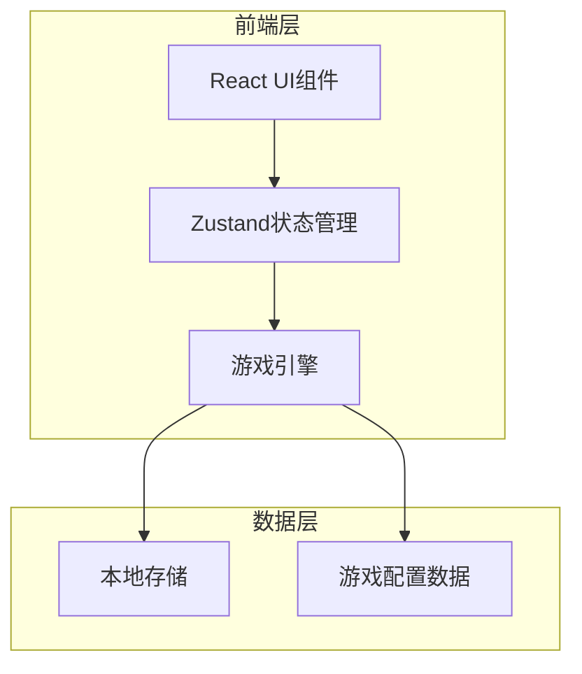
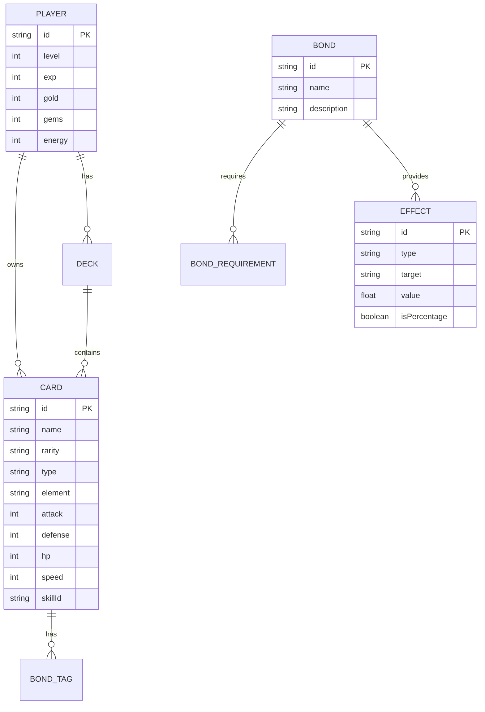

# 文字互动游戏 - 技术架构文档

## 1. 架构设计



## 2. 技术说明

- **前端框架**: React 18 + TypeScript
- **样式方案**: Tailwind CSS 3
- **状态管理**: Zustand (轻量级状态管理)
- **构建工具**: Vite
- **动画库**: Framer Motion
- **数据持久化**: LocalStorage
- **后端服务**: 无 (纯前端单机游戏)

## 3. 路由定义

| 路由 | 用途 |
|------|------|
| `/` | 主界面 |
| `/adventure` | 冒险关卡选择 |
| `/adventure/:id` | 关卡详情/战斗 |
| `/gacha` | 抽卡系统 |
| `/collection` | 卡片收集/背包 |
| `/bonds` | 羁绊图鉴 |
| `/deck` | 卡组编辑 |

## 4. 核心模块设计

### 4.1 游戏状态管理
```typescript
interface GameState {
  player: {
    level: number;
    exp: number;
    gold: number;
    gems: number;
    energy: number;
  };
  cards: Card[];
  deck: string[]; // 卡组中的卡片ID
  unlockedStages: string[];
  completedStages: string[];
  gacha: {
    pitySR: number;
    pitySSR: number;
  };
}
```

### 4.2 战斗系统
```typescript
interface BattleState {
  turn: number;
  player: BattleUnit;
  enemy: BattleUnit;
  activeBonds: Bond[];
  activeEffects: ActiveEffect[];
  log: BattleLogEntry[];
}

interface BattleUnit {
  maxHp: number;
  currentHp: number;
  attack: number;
  defense: number;
  speed: number;
  skills: Skill[];
  cooldowns: Record<string, number>;
}
```

### 4.3 羁绊系统
```typescript
interface BondSystem {
  checkBonds(cards: Card[]): Bond[];
  calculateEffects(bonds: Bond[]): Effect[];
  applyEffects(baseStats: Stats, effects: Effect[]): Stats;
}
```

## 5. 数据模型

### 5.1 实体关系图


### 5.2 卡片数据结构
```typescript
const cardDatabase: Card[] = [
  {
    id: 'card_001',
    name: '烈焰剑士',
    rarity: 'SSR',
    type: 'attack',
    element: 'fire',
    baseStats: { attack: 150, defense: 60, hp: 800, speed: 90 },
    skill: {
      name: '烈焰斩击',
      description: '造成150%攻击力的火焰伤害',
      cooldown: 3,
      effect: { type: 'damage', value: 1.5, element: 'fire' }
    },
    bondTags: ['fire', 'warrior', 'sword']
  },
  // ... 更多卡片
];
```

### 5.3 羁绊配置
```typescript
const bondDatabase: Bond[] = [
  {
    id: 'bond_fire_trio',
    name: '火焰三重奏',
    requiredTags: [{ tag: 'fire', count: 3 }],
    effects: [
      { type: 'stat_boost', target: 'team', value: 30, isPercentage: true, stat: 'attack' }
    ],
    description: '队伍中有3张火元素卡片时，全队攻击力+30%'
  },
  {
    id: 'bond_sword_shield',
    name: '剑与盾',
    requiredTags: [
      { tag: 'sword', count: 1 },
      { tag: 'shield', count: 1 }
    ],
    effects: [
      { type: 'special', target: 'self', value: 20, description: '防御时反弹20%伤害' }
    ],
    description: '剑士与守护者同行，防御时反弹伤害'
  },
  // ... 更多羁绊
];
```

## 6. 项目结构

```
src/
├── components/          # UI组件
│   ├── common/         # 通用组件
│   │   ├── Button.tsx
│   │   ├── Card.tsx
│   │   └── Modal.tsx
│   ├── battle/         # 战斗组件
│   │   ├── BattlePanel.tsx
│   │   ├── SkillButton.tsx
│   │   └── BattleLog.tsx
│   ├── gacha/          # 抽卡组件
│   │   ├── GachaPanel.tsx
│   │   ├── CardReveal.tsx
│   │   └── GachaResult.tsx
│   ├── bond/           # 羁绊组件
│   │   ├── BondList.tsx
│   │   ├── BondCard.tsx
│   │   └── BondEffect.tsx
│   └── layout/         # 布局组件
│       ├── Header.tsx
│       └── Navigation.tsx
├── pages/              # 页面组件
│   ├── Home.tsx
│   ├── Adventure.tsx
│   ├── Gacha.tsx
│   ├── Collection.tsx
│   ├── Bonds.tsx
│   └── Deck.tsx
├── store/              # 状态管理
│   ├── gameStore.ts
│   ├── battleStore.ts
│   └── uiStore.ts
├── data/               # 游戏数据
│   ├── cards.ts
│   ├── bonds.ts
│   ├── stages.ts
│   └── enemies.ts
├── hooks/              # 自定义Hooks
│   ├── useBattle.ts
│   ├── useGacha.ts
│   └── useBonds.ts
├── utils/              # 工具函数
│   ├── battleEngine.ts
│   ├── bondCalculator.ts
│   └── effectStacking.ts
├── types/              # TypeScript类型
│   ├── card.ts
│   ├── bond.ts
│   └── battle.ts
├── App.tsx
└── main.tsx
```

## 7. 核心算法

### 7.1 抽卡算法
```typescript
function gacha(pitySR: number, pitySSR: number): Card {
  const roll = Math.random() * 100;
  
  // 保底检查
  if (pitySSR >= 50) return getRandomCardByRarity('SSR');
  if (pitySR >= 10) return getRandomCardByRarity('SR');
  
  // 正常概率
  if (roll < 2) return getRandomCardByRarity('SSR');
  if (roll < 10) return getRandomCardByRarity('SR');
  if (roll < 40) return getRandomCardByRarity('R');
  return getRandomCardByRarity('N');
}
```

### 7.2 羁绊检测算法
```typescript
function detectBonds(cards: Card[], bondDatabase: Bond[]): Bond[] {
  const activeBonds: Bond[] = [];
  
  for (const bond of bondDatabase) {
    let activated = true;
    for (const req of bond.requiredTags) {
      const count = cards.filter(c => c.bondTags.includes(req.tag)).length;
      if (count < req.count) {
        activated = false;
        break;
      }
    }
    if (activated) activeBonds.push(bond);
  }
  
  return activeBonds;
}
```

### 7.3 效果叠加算法
```typescript
function stackEffects(baseStats: Stats, effects: Effect[]): Stats {
  const flatBoosts: Record<string, number> = {};
  const percentBoosts: Record<string, number> = {};
  
  // 分类收集效果
  for (const effect of effects) {
    const key = effect.stat;
    if (effect.isPercentage) {
      percentBoosts[key] = (percentBoosts[key] || 0) + effect.value;
    } else {
      flatBoosts[key] = (flatBoosts[key] || 0) + effect.value;
    }
  }
  
  // 应用效果
  const result = { ...baseStats };
  for (const [stat, value] of Object.entries(flatBoosts)) {
    result[stat] += value;
  }
  for (const [stat, value] of Object.entries(percentBoosts)) {
    result[stat] *= (1 + value / 100);
  }
  
  return result;
}
```

## 8. 动画设计

### 8.1 卡牌翻转动画
- 使用 Framer Motion 实现 3D 翻转效果
- 稀有度决定粒子特效强度
- SSR/SSR 卡牌额外添加光晕效果

### 8.2 战斗动画
- 技能释放时的缩放震动效果
- 伤害数字飘字动画
- 羁绊激活时的连线闪光效果

### 8.3 UI过渡动画
- 页面切换使用淡入淡出
- 列表项使用交错动画
- 按钮悬浮微动效
